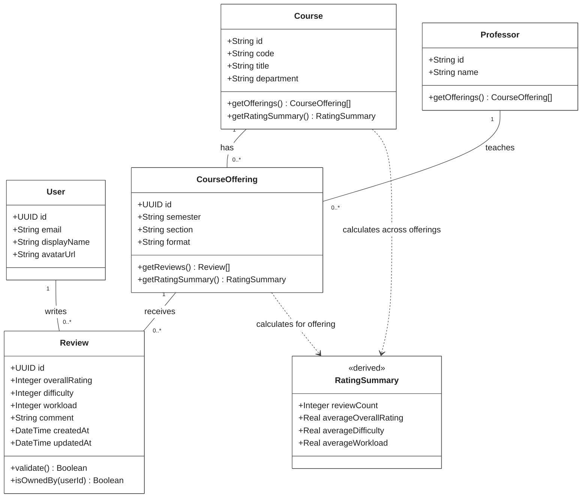
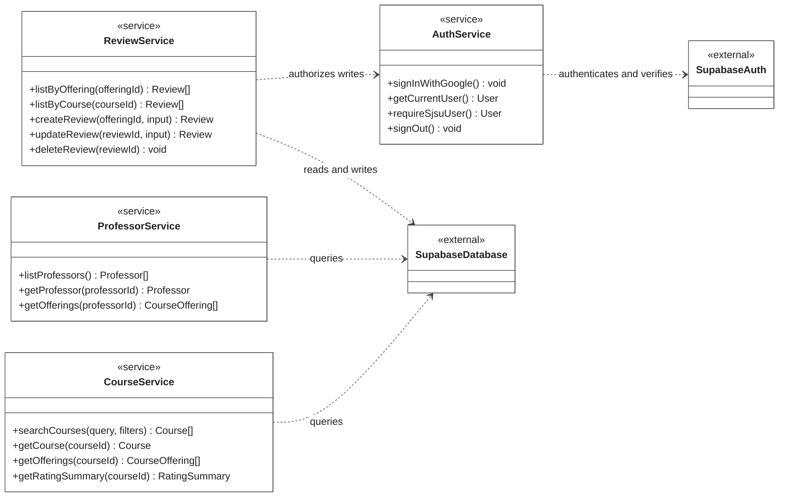

# SJSU Course Ratings: UML Class Diagram

**Scope:** Intended finished system, based on the current code, the four sequence diagrams in this directory, and the seven committed features on page 11 of `../../proj_doc.pdf`. These are proposed logical classes and responsibilities, not a claim that equivalent TypeScript classes or database tables already exist.

The application uses React functions and Next.js route handlers. The logical classes below can be implemented with TypeScript types and functions; the diagram does not require converting the application to object-oriented classes.

## Domain Classes

White-background exports: [PNG image](class_diagram.png) and [SVG image](class_diagram.svg). The standalone, editable Mermaid source is [class_diagram.mmd](class_diagram.mmd).

`+` means public. `1` means exactly one; `0..*` means zero or more. Solid lines are associations. Dashed arrows are dependencies. `derived` marks values calculated from reviews. No inheritance, aggregation, or composition is asserted because the source material does not establish subtype or deletion-lifecycle rules.

### Relationships And Rules

- A user can write many reviews. Every review has exactly one author, including reviews whose author might eventually be hidden in the public UI.
- A course can have many offerings. Each offering identifies one course taught by one professor in a particular semester and section, with a class format such as in-person, online, or hybrid.
- A professor can teach many offerings. Courses and professors therefore have an indirect many-to-many relationship through `CourseOffering`.
- Every review targets exactly one offering, following `review_sequence.png`, which explicitly inserts `user_id` and `offering_id`. Its course and professor are obtained through that offering.
- Association links represent object references. A relational implementation would use `Review.user_id`, `Review.offering_id`, `CourseOffering.course_id`, and `CourseOffering.professor_id`; these are not duplicated as attributes in this conceptual diagram.
- Only an authenticated, verified SJSU user may submit a review. The server must enforce ownership for edits and deletion; hiding UI controls is not authorization. Passwords and authentication tokens are managed by Supabase Auth, not stored on this application-level `User` model.
- Overall rating, difficulty, and workload use a proposed integer scale from 1 to 5. Exact workload labels remain a design choice. `validate()` checks the rating ranges and required, nonblank comment.
- A course summary aggregates all reviews across its offerings, with each review weighted equally. An offering summary includes only that offering's reviews. `reviewCount` is zero and averages are absent (`null`) when there are no reviews; an empty course is not rated zero.
- `getOfferings()`, `getReviews()`, and `getRatingSummary()` describe logical responsibilities. Their implementation can reside in query or service functions. Domain methods are synchronous UML signatures; actual database operations will be asynchronous.

## Application Services

This companion view assigns the sequence-diagram operations to proposed services. It does not imply these services are currently implemented. External dependencies are intentionally summarized rather than reproducing the Supabase SDK.

`getCurrentUser()` can return no user for an anonymous visitor. `requireSjsuUser()` must fail unless the server verifies both authentication and SJSU eligibility. Review write methods obtain the author from that verified context, not a client-supplied user ID. Update and delete also compare that identity with the stored review author.

Search supports department, course number/code, and title. Proposed offering filters are professor, semester, and format. Read operations can support visitors without accounts; the exact guest-access policy remains to be confirmed. OAuth sign-in initiates a redirect; a session is established after the provider callback rather than returned immediately from `signInWithGoogle()`.

### Sequence Diagram Mapping

| Existing diagram | Intended responsibility | Domain classes |
| --- | --- | --- |
| [login_sequence.png](login_sequence.png) | Sign in through Supabase and establish an authenticated user/session | `User`; external Supabase session |
| [course_sequence.png](course_sequence.png) | List courses and retrieve a course's offerings | `Course`, `CourseOffering`, `Professor` |
| [prof_sequence.png](prof_sequence.png) | List professors and retrieve a professor's offerings | `Professor`, `CourseOffering`, `Course` |
| [review_sequence.png](review_sequence.png) | Verify the user, validate input, and create a review for an offering | `User`, `Review`, `CourseOffering` |

The course and professor sequence diagrams specify `GET /api/courses/:id/offerings` and `GET /api/professors/:id/offerings`. The review diagram specifies `POST /api/reviews`. Editing and deletion come from the committed project specification, even though they do not yet have sequence diagrams here.

## Design Assumptions And Open Details

| Detail | Choice in this diagram | Basis or remaining decision |
| --- | --- | --- |
| Course versus offering | A course is a catalog entry; an offering adds professor, semester, section, and format | Course/professor sequence diagrams distinguish these concepts. The dashboard's current `ClassOffering` type actually represents a catalog card. |
| One professor per offering | Exactly one | Inferred from the selected-professor review flow. Co-teaching would require multiple professors per offering. |
| Semester | A string that includes term and year, such as `Fall 2026` | Semester appears in both browsing sequence diagrams; no dedicated semester entity or schema exists. |
| Identifiers | Existing course/professor string IDs; proposed UUIDs for offerings and reviews | Current pages use slugs. The database schema is not present in the repository. The user ID should match the Supabase Auth ID. |
| User profile | Name and avatar are optional display metadata | `ProfileMenu` already reads Supabase user metadata. No password field belongs in the domain class. |
| SJSU eligibility | Server-verified authentication and institutional eligibility | Required by the committed specification. The exact accepted identity/domain policy is not specified, so no hard-coded policy is invented. |
| Extra review fields | Optional extensions: `careerRelevancy: Integer`, `gradeLeniency: Integer`, `attendanceMandatory: Boolean` | The proposed course-review UI plan adds these fields. They are not part of the three core metrics committed in the specification. Confirm the final form before making them required. |
| Review frequency | No uniqueness constraint is assumed | The sources do not say whether one user may submit multiple reviews for the same offering. |
| Course completion | Reviewers are expected to have taken the course | The specification states this requirement but provides no enrollment or completion-verification mechanism. |
| Public author visibility | Ownership is retained internally | Whether reviews display a name or are anonymous is not settled in the source material. |
| Pinned courses and major | Outside the committed core model | The dashboard's pinned courses and sidebar major choices are currently local/static UI data; persistent behavior is unspecified. |
| Tags, messaging, rankings, comparison, scraping, and historical analytics | Outside this diagram's core scope | Discussed in survey/feature ideas, but not included in the final seven committed features. |

## Current Implementation Versus Intended Design

- Google OAuth initiation, session reading, profile metadata, and sign-out are wired to the browser Supabase client. This inspection does not verify the deployed authentication configuration.
- Email/password submission currently validates password confirmation but does not call authentication. Account creation/sign-in beyond the Google flow remains intended behavior delegated to Supabase Auth, not a custom password model.
- `GET /api/users`, `GET /api/courses`, and `GET /api/reviews` return empty arrays. The professor API, offering queries, review writes, and database schema are not implemented in this checkout.
- Course and professor pages use placeholders. The proposed course-review UI plan is explicitly marked as not yet implemented.
- The login sequence diagram routes login through `POST /api/auth/login`; the current `AuthForm` invokes Supabase OAuth directly. `AuthService` is a logical responsibility that can accommodate either integration without implying that the depicted route currently exists.

## Sources

- [Project specification](../../proj_doc.pdf), pages 10-11, especially **Features We Will Commit To** on page 11.
- The four linked sequence diagrams above.
- [Dashboard and catalog-card type](../src/app/%28app%29/dashboard/page.tsx).
- [Course list](../src/app/%28app%29/courses/page.tsx) and [course detail](../src/app/%28app%29/courses/%5BcourseId%5D/page.tsx).
- [Professor list](../src/app/%28app%29/professors/page.tsx) and [professor detail](../src/app/%28app%29/professors/%5BprofessorId%5D/page.tsx).
- [Authentication form](../src/components/auth-form.tsx), [profile menu](../src/components/profile-menu.tsx), and [Supabase client](../src/lib/supabase/client.ts).
- [Proposed course-review UI plan](../docs/superpowers/plans/2026-09-27-course-review-ui.md).
